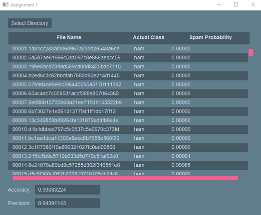

# csci2020u_Assignment_1
Assignment 1 of Crawford Heidinger and Alessandro Prataveira 

Overview
---------------------------------------------------
Our project uses a mix of java, javafx and css to create a
spam filter. The code then trains itself to determine what emails 
are spam and what emails are ham. We then use test files which are 
already determined to be spam and ham and find out how accurate our
code is in determining whether something is spam or ham.

Improvements
-----------------------------------------------------------------------------------------------
The basic improvement we made to the UI is adding css which makes the UI cleaner and
easier to read. There are many small features the language adds to a UI that it gives a greater
edge over the regular javafx interface.

Another improvement that was made was to the algorithm.  This was done by adding another equation to deal 
with rare words or words that had not shown up.

Adding this equation increased the accuracy and precision of the algorithm by about 40%.  It does this by 
taking into account the number of times a word was come across, and ignores words with little to no information.

How to Run
-----------------------------------------------------------------------------------------------
In order to run our program you will need to download a java that is greater than java 8 and less than java 13. 
You must also get a java that can compile javafx code as well since the regular java versions won't do this. 
There is a website that you can download a combined version of java and javafx called azul, and I would 
recommend you go there to download it. The recommended IDE that we use is Intellij as it is meant for the 
java coding language, and it is easy to set up, but Intellij is not needed. Once all the setup is complete, and you 
have everything downloaded, you can clone our repository in your terminal which is done with a simple git 
clone, and the repository website link. This will import all the code onto your machine for use. Then you 
are free to play around with our code make changes or just run it for yourself using the built-in run 
button in Intellij!

Steps to use the spam detector:
1. Compile the code in an IDE or run the .jar or .bat file in the out directory
2. Click on the  button
3. Inside the file explorer press enter or select a different directory(the correct directory is selected by default)

*NOTE*:
If you want to use a different directory, it must contain:
1. A directory called train with folders ham, ham2, and spam
2. A directory called test with folders ham and spam

Resources
-----------------------------------------------------------------------------------------------
https://www.azul.com/downloads/zulu-community/?package=jdk

https://www.jetbrains.com/idea/

